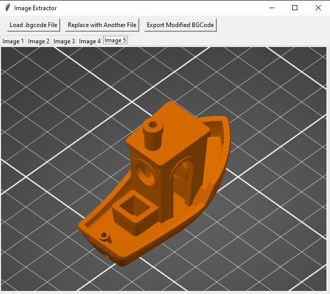

# BGCode Image Extractor for Prusa Printers

This GUI tool allows you to **load**, **preview**, **replace**, and **export** embedded images (QOI/PNG) in `.bgcode` files used by Prusa 3D printers. It's particularly useful for editing the preview thumbnails displayed on your printer.


## Features

* Load and parse `.bgcode` files
* View QOI and PNG thumbnails in a tabbed UI
* Replace images from another `.bgcode` file
* Export modified `.bgcode` with new previews
* Supports both QOI and PNG image formats

## Requirements

* Python 3.8+
* Tkinter (included with most Python installations)
* [Pillow](https://python-pillow.org) - image processing
* [numpy](https://numpy.org)
* [qoi](https://github.com/phoboslab/qoi) Python reader or compatible module

Install required packages with:

```bash
pip install pillow numpy qoi
```

## Usage

Run the application with:

```bash
python bgcode_image_switcher.py
```

### Step-by-step

1. Click **Load .bgcode File** to open a `.bgcode` file.
2. View each embedded image on separate tabs.
3. Click **Replace with Another File** to load new images from another `.bgcode`.
4. Ensure the number of images match.
5. Click **Export Modified BGCode** to save the new file.

## How It Works

* **Image Detection:** Searches for QOI (`qoif`) and PNG (`\x89PNG...`) headers and their corresponding end markers.
* **Image Decoding:** Uses `qoi.read()` for QOI and `Pillow` for PNG decoding.
* **Replacement:** Aligns replacement images with original image offsets and reconstructs the full binary output.

## Screenshot

Here is how the tool looks in action:



## Notes

* The replacement `.bgcode` must contain the **same number of image previews**.
* This tool only modifies **embedded image previews**, not G-code commands or print settings.

## License

This project is licensed under the **GNU General Public License v3.0**.


